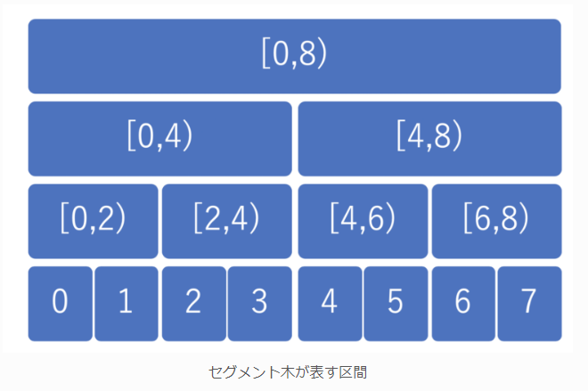
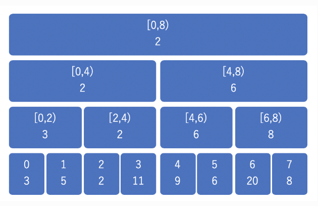
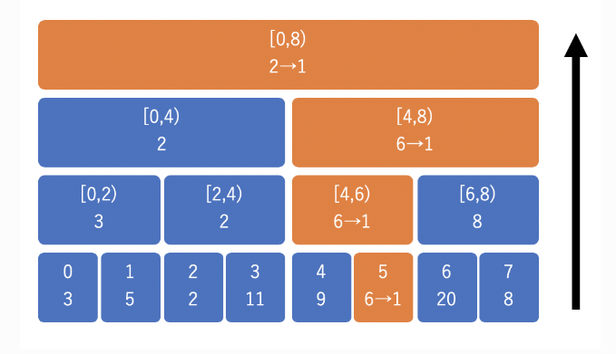
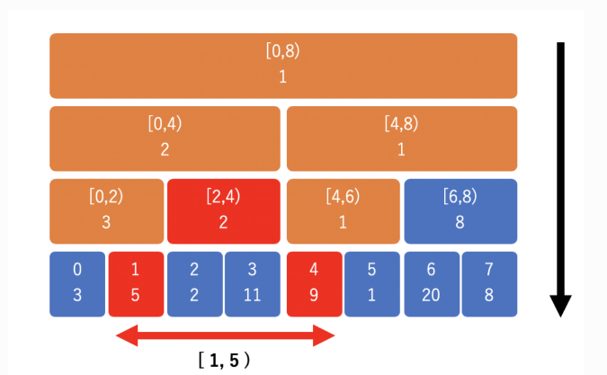

# 1 セグメント木とは

完全二分木によって実装された、区間を扱うのに適したデータ構造。

区間に対する操作を対数時間$\mathcal{O}(\log N)$で行える。

## 1.1 セグメント木でできること

区間に対する操作やクエリを処理することに向いている

- 区間上の値を更新する
- 任意の区間上の最小値や合計値などを取得する

という処理が対数時間で行えるのが強み。

## 1.2 セグメント木のイメージ(気持ち)

セグメント木では、完全二分木のそれぞれのノードが、1 つの区間を表現している。


数列$a=\{3,5,2,11,9,6,20,8\}$についての区間上の最小値 Range Minimam Query(RMQ)を考えてみると、区間上の最小値をノードが持つことになる。


値を更新するときは、子ノードから親ノードへとたどりながら更新していく。高さは$\log N$なので対数時間で更新できる。


ある区間での最小値が知りたいときは親ノードから子ノードへと辿りながら値を確認していく。


# セグメント木の実装(ACL)

- op: セグメント木のための二項演算関数
- e: セグメント木の単位元

## コンストラクタ

大事なのは完全二分木を作成すること

- 入力された vector の長さ < $2^N$となる N をもとめ、$2^N$の 2 倍の長さのベクトルを作成することで、葉の数が$2^N$の完全二分木を作成する
- log: 完全二分木の高さ - 1
- size: 完全二分木の葉の数
- d: 完全二分木を表すベクトル要素
  - 1~size-1: 節ノード
  - size~2\*size-1: 葉ノード
- 親ノード d[i]から子ノードへのアクセス
  - 左の子: d[2*i]
  - 右の子: d[2*i+1]
- 子ノード d[i]から親ノードへのアクセス
  - d[i/2]
- 初期化
  - 葉ノードから

```cpp
// 引数がない時は要素が0のセグ木を作成
segtree() : segtree(0) {}
segtree(int n) : segtree(std::vector<S>(n, e())) {}
segtree(const std::vector<S>& v) : _n(int(v.size())) {
  log = internal::ceil_pow2(_n);
  size = 1 << log;
  d = std::vector<S>(2 * size, e());
  for (int i = 0; i < _n; i++) d[size + i] = v[i];
  for (int i = size - 1; i >= 1; i--) {
      update(i);
  }
}
```

## 更新

値の更新時は、更新したい点から親へとたどりながら、最小値を更新していく

```cpp
// メソッドはこちらを呼び出す
void set(int p, S x) {
  assert(0 <= p && p < _n);
  p += size;
  d[p] = x;
  for (int i = 1; i <= log; i++) update(p >> i);
}
// 内部のアップデート
void update(int k) { d[k] = op(d[2 * k], d[2 * k + 1]); }
```

## 値の取得

op(a[l],...,a[r-1])を求めている。

- point: 根ノード以外の行ノードは偶奇の順に並んでいる

区間値の取得も子から親へとたどっていき、区間に収まるものに対し評価していく。

- l, r が一致したら最初の区間に含まれるものがすべて評価できたので終了
- 左側の評価
  - 偶数番目の時: l < r という条件から親を見ればよいので、評価せずに親ノードに遷移する
  - 奇数番目の時: 左隣りは評価対象ではないので、そのノードを評価する。次に評価する右隣りのノードの親に遷移する。
- 右側の評価
  - 偶数番目の時: 次に評価するべきものは親ノードの左隣だから、評価せずに親ノードに遷移する。
  - 奇数番目の時: 左隣りまでが評価対象なので、そのノードを評価する。次に評価するべきものはその親ノードの左隣だから、その親ノードに遷移する。

```cpp
S prod(int l, int r) {
  assert(0 <= l && l <= r && r <= _n);
  S sml = e(), smr = e();
  l += size;
  r += size;

  while (l < r) {
      if (l & 1) sml = op(sml, d[l++]);
      if (r & 1) smr = op(d[--r], smr);
      l >>= 1;
      r >>= 1;
  }
  return op(sml, smr);
}
```

## セグメント木上での二分探索

### max_right

#### できること

以下の条件を両方満たす r を(いずれか一つ)返す。

- r = l もしくは f(op(a[l], a[l + 1], ..., a[r - 1])) = true
- r = n もしくは f(op(a[l], a[l + 1], ..., a[r])) = false

#### 使用例

[ACL Practice Contest J](https://atcoder.jp/contests/practice2/tasks/practice2_j)

[解答例](https://drken1215.hatenablog.com/entry/2023/11/14/033300)

#### 実装

```cpp
template <bool (*f)(S)> int max_right(int l) {
  return max_right(l, [](S x) { return f(x); });
}
template <class F> int max_right(int l, F f) {
  assert(0 <= l && l <= _n);
  assert(f(e()));
  if (l == _n) return _n;
  l += size;
  S sm = e();
  do {
      while (l % 2 == 0) l >>= 1;
      if (!f(op(sm, d[l]))) {
          while (l < size) {
              l = (2 * l);
              if (f(op(sm, d[l]))) {
                  sm = op(sm, d[l]);
                  l++;
              }
          }
          return l - size;
      }
      sm = op(sm, d[l]);
      l++;
  } while ((l & -l) != l);
  return _n;
}
```

# 参考文献

[セグメント木を徹底解説！0 から遅延評価やモノイドまで](https://algo-logic.info/segment-tree/)
