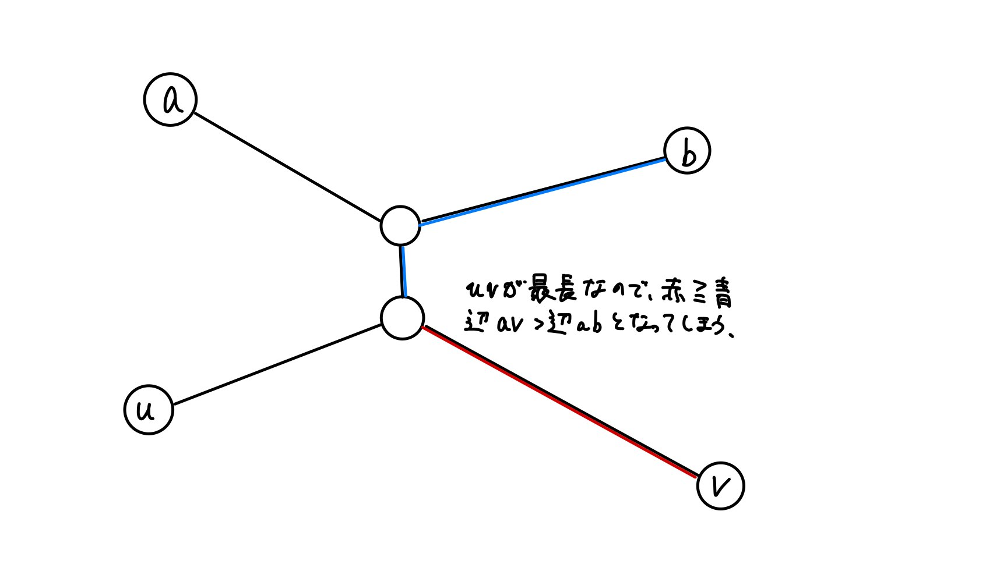

## 問題概要

N 個の都市があり、N-1 本の道路がある。どの都市間もいくつかの道路を通って移動可能。$\rightarrow$連結なグラフであり、(点の数) = (辺の数) + 1 より、このグラフは木である。

このグラフに辺を 1 本加えると閉路が 1 つできることから、「グラフの 2 頂点間の距離の最大値」(=木の直径)を求めればよいことがわかる。

## 木の直径の求め方

1. 適当な頂点 u を 1 つ選ぶ
2. 頂点 u から最も遠い頂点 v を求める ($\mathcal{O}$(N))
3. 頂点 v から最も遠い頂点 w を求める ($\mathcal{O}$(N))

### 簡単な証明

- 木の直径となる 2 点を a、b とする。
- 頂点 u から最も遠い頂点 v を求めると、$v = a or v = b$となる。
  - 辺 uv と辺 ab は交点 c を持つ
    - 持たないと仮定すると、以下の図のようになり辺 ab が木の直径となることに矛盾
  - 点 c から一番遠い葉は a か b のどちらかであるので、v も a か b のどちらかになる。
- 頂点 v から最も遠い頂点 w を求めれば辺 vw は辺 ab と一致する。

### 頂点 s から BFS で dist に距離を保存

```cpp
vector<int> dfs(int s,  vector<vector<int>> &G){
  int N = G.size();

  //頂点 s からの距離
  vector<int> dist(N, -1);
  dist[s] = 0;

  //キューでBFS
  queue<int> q({s});
  while(!q.empty()){
    int v = q.front(); q.pop();
    for(auto nv: G[v]){
      if(dist[nv] != -1) continue;
      q.push(nv);
      dist[nv] = dist[v] + 1;
    }
  }

  return dist;
}
```

### vector<int>で argmax を求める方法

```cpp
// 最大値をとるイテレータを返す
max_element(x.begin(), x.end());

// argmax
distance(x.begin(), max_element(x.begin(), x.end()))
```
